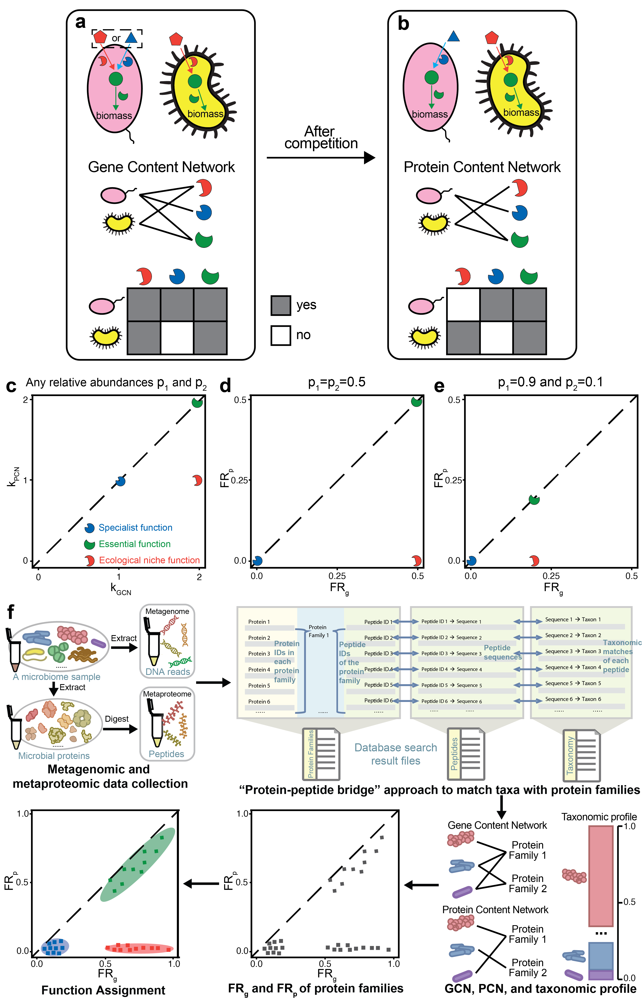

# Pairing Metagenomics and Metaproteomics to Characterize Ecological Niches and Metabolic Essentiality of Microbial Communities 
This repository contains scripts needed to compare the gene-level functional redundancy $\text{FR}_g$ and the protein-level functional redundancy $\text{FR}_p$. The comparison between $\text{FR}_g$ and $\text{FR}_p$ enables us to understand the ecological and metabolic roles of each protein function. A preprint that describes the method in detail can be found [here](https://www.biorxiv.org/content/10.1101/2022.11.04.515228v1.abstract). 


## Versions
The version of Python we used is 3.7.3.

## Dependencies
Necessary Python packages can be found in `requirements.txt`. Installing those packages can be achieved by pip:
```
pip install -r requirements.txt
```

The entire installation process takes less than half an hour for the setting we used (Macbook Air M1 2020, 8GB RAM, 512GB SSD).

## Workflow for generating GCN (Gene Content Network)
* **Step 1**: READ ASSEMBLY with MEGAHIT (https://github.com/voutcn/megahit): NGS assembler optimized for metagenomes - output (contigs): 
    ```
    megahit -1 SAMPLE_R1.fastq.gz  -2 SAMPLE_R2.fastq.gz  -t 12  -o megahit_result
    ```
    The assembled contigs are in the fasta file: `./megahit_result/final.contigs.fa`.
* **Step 2**: GENE PREDICTION with Prodigal (https://github.com/hyattpd/Prodigal) - output (ORFs/PCGs):
    ```
    prodigal -i ./megahit_result/final.contigs.fa -o prodigal.genes -a prodigal.proteins.faa
    ```
    It generated translated proteins as the output file `prodigal.proteins.faa`.
* **Step 3**: Use Eggnog-mapper (https://github.com/eggnogdb/eggnog-mapper) to annotate translated proteins in the fasta files as COGs/KEGGs.
    ```
    emapper.py -i prodigal.proteins.faa -o test --cpu 0
    ```
    The output file `test.emapper.annotations` gives the COG/KEGG annotations to all proteins.
* **Step 4**: Taxonomic classification using LCA algorithm in DIAMOND (https://github.com/bbuchfink/diamond): 
    ```
    diamond blastp -d nr -q prodigal.proteins.faa -o diamond-TaxaIDs.tsv -f 102
    ```
* **Step 5**: the output files from steps 3 and 4 can be combined based on protein IDs to create the GCN that links taxa to COGs/KEGGs.


## Workflow for generating PCN (Protein Content Network)
* **Step 1**: Use MaxQuant 1.6.17.0 (https://www.maxquant.org/) to perform a database search based on the combined non-redundant FASTA database or user-defined database. MaxQuant takes the raw metaproteomic data and generates the detected peptides and proteins by metaproteomics. MaxQuant is a Windows desktop app that can be opened as a graphical user interface.
* **Step 2**: We can generate PCN based on the following three files: (1) the output file of detected proteins from step 1, (2) the COG/KEGG annotation from step 3 in the generation of GCN, and (3) the taxonomic classification from step 4 in the generation of GCN.

## Workflow for comparing $\text{FR}_g$ and $\text{FR}_p$ based on GCN and PCN
The entire process is performed in Python. Examples such as `synthetic_data.ipynb` and `real_data_analysis.ipynb` are shown below. Here is a summary:
* **Step 1**: Load the GCN and PCN generated based on the workflows above.
* **Step 2**: Compute $\text{FR}_g$ and $\text{FR}_p$ based on GCN and PCN.
* **Step 3**: Visualize the comparison between $\text{FR}_g$ and $\text{FR}_p$ and classify three functional clusters.

## Description of scripts
The script `community_model.ipynb` presents how the community assembly is simulated in silico. It first created a pool of species with random abilities and later combined all species in the same community to find survived species after their competition. Both essential functions and alternative resource consumption functions are included in the model. More details about the model can be found in the [manuscript](https://www.biorxiv.org/content/10.1101/2022.11.04.515228v1.abstract).

The script `synthetic_data.ipynb` takes the microbial relative abundances, GCN (Gene Content Network) and PCN (Protein Content Network) from the synthetic data and computed $\text{FR}_g$ and $\text{FR}_p$ for each protein function. Then we compare $\text{FR}_g$ and $\text{FR}_p$ for each modeled function and assign the functional cluster to it. 

The script `real_data_analysis.ipynb` demonstrates how to load the GCN and PCN for the real dataset of the human gut microbiome from subject HM454. It compared $\text{FR}_g$ with $\text{FR}_p$ for each COG and assign the functional cluster to it.

## Example
We have simulated the result of one community assembly and saved the data to the "model_simulation_results.pickle". Here, the script `synthetic_data.ipynb` directly takes the simulated data from "community_model.ipynb", including the microbial relative abundances for survived species, GCN (Gene Content Network) and PCN (Protein Content Network). The script generated results and figures similar to the [paper](https://www.biorxiv.org/content/10.1101/2022.11.04.515228v1.abstract).

The script `real_data_analysis.ipynb` can be directly run to obtain Figs. 3 and 4 as well as other similar supplementary figures of the [paper](https://www.biorxiv.org/content/10.1101/2022.11.04.515228v1.abstract).

## License
This project is covered under the **MIT License**.